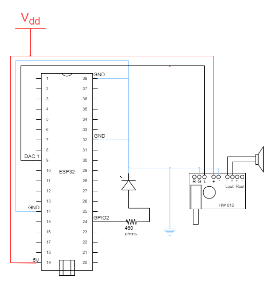

# Miscelanious tools project details

This document describes the electronic construction of this project.

## Electronic componets

- 1x Esspresif ESP32.
- 1x audio amplifier for 5v and 3W output.
- 1x 5v tension stabilizer module.
- 1x 8ohms speaker.

## Electric diagram

## Prototype

For testing and viability purposes I built a full prototype that runs the Miscelanious tools and offers a good user experience. The prototype follows exactly the connections of the Electric diagram.
